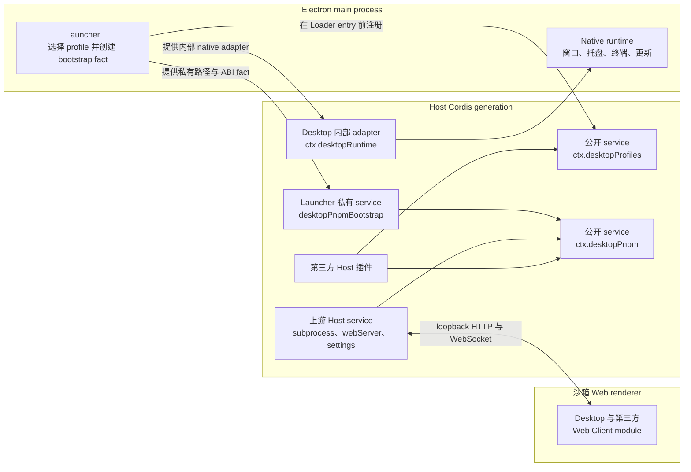

# e-Mate 插件 service

[English](plugin-services.md) | 中文

本文档是面向插件作者、受支持的 Host 侧集成 contract，覆盖 e-Mate 2.x 在兼容与高级两种呈现模式下导出的公开 `desktopProfiles` 与 `desktopPnpm` Cordis service。它不会授予第三方访问原始 Electron API、renderer 或 launcher bootstrap 状态的能力。

## 分层与数据流



Launcher 会在 Loader tree 挂载前解析一个 profile。`desktopProfiles.current` 在整个 Cordis generation dispose 前保持不变。`desktop-pnpm` Host row 会根据 launcher 私有 fact 与上游 subprocess service 构造 `desktopPnpm`。选择另一个 profile 会 dispose 当前 generation 并启动新 generation；service reference 不能跨越该边界。e-Mate 自身没有模式切换：macOS 与 Windows 组合 advanced 模式，Linux 组合 compatibility 模式。其他产品如果以显式模式挂载该可复用 package，仍由该产品拥有自己的 generation 边界。

Renderer 通过现有 loopback carrier 接收普通 Web Client module，无法直接读取这些 Host service；e-Mate 也不会为它们增加 preload 或 Electron IPC bridge。包含浏览器 UI 的插件继续使用普通 DSH Host route、RPC、client metadata、service 与 slot。

## 公开 Cordis service

请从受支持的 contract 路径执行 type-only import：

```ts
import type {
  DesktopCurrentProfile,
  DesktopProfiles,
} from '@e-mate/desktop/profile-service'
import type {
  DesktopPnpm,
  DesktopPnpmHandle,
  DesktopPnpmOutcome,
} from '@e-mate/desktop/pnpm'
```

`@e-mate/desktop/profiles` 是 Desktop 自有托盘 consumer，不是 profile service contract。不要从该路径导入 service 类型。

### `desktopProfiles`

```ts
interface DesktopProfiles {
  readonly current: {
    readonly name: string
    readonly dir: string
  }
  list(): readonly DesktopProfileSummary[]
  select(name: string): Promise<void>
}
```

- `current` 在一个 generation 内不可变。`name` 是 launcher 选择的 profile 名称，`dir` 是其 manifest 绝对目录。不要从 argv、`ctx.baseUrl`、settings、Loader row 或 `$DSH_HOME` 推断两者。
- `list()` 会重新读取 profile manifest，但不会改变 patch、dependency 或 bundle 顺序。返回项可以描述可见但不可选择的 profile。
- `select(name)` 是重启 operation，不是就地 mutation。它会先持久化被接受的目标，再请求有序 Cordis teardown 与 Electron relaunch。
- 同一目标的并发调用会共享一个 operation。目标被提交为 pending 后，其它目标会在重启前被拒绝。持久化失败会释放选择 slot；重启失败则保留已提交目标，使同一个 restart 可以重试而不会覆盖状态。
- Service dispose 后，通过保留 reference 发起的调用会失败。应从下一 generation 重新读取 `current`，不能全局缓存旧 service。

### `desktopPnpm`

```ts
interface DesktopPnpm {
  run(args: readonly string[], signal?: AbortSignal): DesktopPnpmHandle
  runPlugin(
    args: readonly string[],
    invokingDir: string,
    signal?: AbortSignal,
  ): DesktopPnpmHandle
}

interface DesktopPnpmHandle {
  readonly stdout: NodeJS.ReadableStream
  readonly stderr: NodeJS.ReadableStream
  readonly done: Promise<{
    readonly exitCode: number | null
    readonly signal: NodeJS.Signals | null
  }>
  cancel(): void
}
```

实际 stream 类型是 Node 的 `Readable`。两个方法都会校验非空且不含 NUL 的 argv；`runPlugin()` 还要求 `invokingDir` 是不含 NUL 的绝对路径。

| 方法 | 进程与 working directory | 受支持用途 |
| --- | --- | --- |
| `run(args, signal?)` | 直接执行已打包 pnpm JavaScript entry，以激活 profile 目录为 `cwd`。 | 调用方明确不需要 DSH 插件 reconcile 的低层 pnpm 工作。 |
| `runPlugin(args, invokingDir, signal?)` | 以调用方绝对目录为 CLI `cwd`，执行已打包 `dsh plugin --profile <active> ...`；上游 DSH 会为 pnpm 进入 profile。 | 插件 add、remove、update、collection 修复或 dependency 修复。 |

`run()` 不是 `runPlugin()` 的短写。直接 pnpm 不承诺首次 profile 初始化、调用方相对 `file:` 或 `link:` source 锚定，也不承诺成功后的 `dsh.profile.bundles` reconcile。插件管理器若使用错误方法，package 可能已经出现在 dependency 中，却没有加入 Loader layer stack。

`runPlugin()` 会保留普通 DSH CLI 对这些行为的权威性。它的 `args` 是 `dsh plugin --profile <active>` 之后转发给 pnpm 的参数，例如：

```ts
['add', 'example-plugin']
['remove', 'example-plugin']
['update']
['install', '--no-frozen-lockfile']
```

Service 在每个 generation 同时最多启动一个 package operation；已有 operation 活跃时再次调用会同步抛错。它只暴露输出，不选择 progress UI，也没有内置 timeout。Consumer 拥有 deadline、读取两个 stream、报告 progress、在需要时调用 `cancel()` 或 abort signal、等待 `done`，并同时检查 `exitCode` 与 `signal`。

无效 argv、无效 `invokingDir`、已经关闭或忙碌的 generation，以及调用前就已 abort 的 signal，都会在返回 handle 前同步抛错。Handle 存在后，cancellation 与 generation teardown 会作用于完整 subprocess tree。`done` 不会仅因直接 wrapper 退出而 settle；在后代进程消失前，operation gate 始终保持占用。异步 spawn-level failure 会 reject `done`，普通命令失败则 resolve 为非零 exit code。在 Windows 上，provider 会使用 argv 启动准确的已打包 entry，并把进程树 ownership 委托给 subprocess service，因此插件作者无需发现 `.cmd` shim，也不应拼接 shell 文本。

## 内部与 launcher 私有 capability

| 名称 | 边界 | 面向插件作者的状态 |
| --- | --- | --- |
| `desktopProfiles` | 作用于 generation 的 Host service。 | 公开；通过 `@e-mate/desktop/profile-service` 获得受支持 contract。 |
| `desktopPnpm` | 作用于 generation 的 Host service。 | 公开；通过 `@e-mate/desktop/pnpm` 获得受支持 contract。 |
| `desktopRuntime` | Launcher 提供的 native adapter，供 Desktop 自有 shell、tray、terminal、profile 与 update row 使用。 | Desktop 内部。第三方插件不得 inject，也不得依赖其 window/tray 方法。 |
| `desktopPnpmBootstrap` | 提供给 `desktop-pnpm` provider 的已打包绝对路径、被选 profile fact、Electron ABI 值与私有 Node helper。 | Launcher 私有。不得读取、provide、intercept 或声明为 dependency。 |
| `DesktopProfileServiceBootstrap` | Launcher 注册 `desktopProfiles` 时使用的 constructor input；它不是 Cordis service。 | Launcher 私有实现细节。 |

私有类型出现在生成的 declaration 中，并不代表其 runtime service 成为了受支持第三方 capability。两个公开 service 名称及其 contract module 才是兼容边界。

## Injection 模式

### 仅支持 Desktop 的插件：required injection

只在 e-Mate 中有意义的插件可以把两个 service 都声明为 required dependency。Cordis 会让插件保持 pending，直到两个 provider 都可用；任一 required service 消失时，插件 effect 会被 unload。

```ts
import type { Context } from '@deepseek-ai/cordis'
import type {} from '@e-mate/desktop/profile-service'
import type { DesktopPnpmHandle } from '@e-mate/desktop/pnpm'

export const name = 'example-desktop-plugin-manager'
export const inject = ['desktopProfiles', 'desktopPnpm']

declare function registerInstallAction(
  callback: (target: string) => Promise<void>,
): () => void

export function apply(ctx: Context): void {
  ctx.logger.info(`active Desktop profile: ${ctx.desktopProfiles.current.name}`)
  ctx.effect(() => {
    let active: DesktopPnpmHandle | undefined
    const disposeAction = registerInstallAction(async (target) => {
      // 先校验 target；该 callback 表示显式用户操作。
      const signal = AbortSignal.timeout(5 * 60_000)
      const operation = ctx.desktopPnpm.runPlugin(['add', target], process.cwd(), signal)
      active = operation
      operation.stdout.setEncoding('utf8')
      operation.stderr.setEncoding('utf8')
      operation.stdout.on('data', chunk => ctx.logger.info(String(chunk).trimEnd()))
      operation.stderr.on('data', chunk => ctx.logger.warn(String(chunk).trimEnd()))
      try {
        const outcome = await operation.done
        if (outcome.exitCode !== 0) {
          throw new Error(`plugin install failed: exit=${String(outcome.exitCode)} signal=${String(outcome.signal)}`)
        }
      } finally {
        if (active === operation) active = undefined
      }
    })
    return async () => {
      disposeAction()
      const operation = active
      operation?.cancel()
      await operation?.done.catch(() => {})
    }
  }, 'example: package-manager user action')
}
```

生产代码必须在调用 package manager 前根据插件自身 trust policy 校验 `target`。进程 exit code 为零也不能替代领域相关的 post-install validation。

### 跨环境插件：可选 Desktop adapter 与普通 DSH fallback

当同一个 package 必须在普通 DSH 中激活时，不要把 Desktop service 放入顶层 required `inject` 列表。Launcher 会在 Loader entry 挂载前注册 `desktopProfiles`，因此它是否存在可以区分 Desktop 环境。若存在，创建嵌套 `ctx.inject()` callback 等待 `desktopPnpm`；若不存在，挂载已有普通 DSH 实现。

```ts
import type { Context } from '@deepseek-ai/cordis'
import type {} from '@e-mate/desktop/profile-service'
import type {} from '@e-mate/desktop/pnpm'

export const name = 'cross-environment-plugin-manager'
export const inject = ['webServer', 'loader']

interface ManagerAdapter {
  readonly profile: string
  readonly profileDir?: string
  runPlugin(
    args: readonly string[],
    invokingDir: string,
    signal?: AbortSignal,
  ): unknown
}

declare function mountManager(ctx: Context, adapter: ManagerAdapter): () => void
declare function ordinaryDshAdapter(profile: string): ManagerAdapter

export function apply(ctx: Context, config: { profile?: string }): void {
  const profiles = ctx.get('desktopProfiles')
  if (profiles === undefined) {
    // 现有非 Desktop 行为在此保持权威。
    const profile = config.profile ?? 'web'
    ctx.effect(
      () => mountManager(ctx, ordinaryDshAdapter(profile)),
      'example: ordinary DSH plugin manager',
    )
    return
  }

  // 对该嵌套 callback 而言，ctx.inject() 仍把 desktopPnpm 视为 required。
  // Desktop-only dependency 没有进入顶层 inject，所以 parent 插件仍能在普通 DSH 中加载。
  ctx.inject(['desktopPnpm'], (desktopCtx) => {
    desktopCtx.effect(() => mountManager(desktopCtx, {
      profile: profiles.current.name,
      profileDir: profiles.current.dir,
      runPlugin: (args, invokingDir, signal) =>
        desktopCtx.desktopPnpm.runPlugin(args, invokingDir, signal),
    }), 'example: Desktop plugin manager')
  })
}
```

`ctx.inject()` 不是 optional-dependency declaration：传给 callback 的每个名称在该 callback 内都是 required。这里使用它，是为了只让嵌套 Desktop adapter 等待 `desktopPnpm`，而外层插件仍拥有普通 fallback。对于纯新增 Desktop feature，也可以用同样的嵌套模式在 service 存在时贡献 effect，其它环境不做任何操作。

`desktopProfiles` 已存在后，绝不能回退到猜测的 `web` profile。部分缺失或启动失败的 Desktop provider set 属于 Desktop generation failure，不是通过 ambient CLI 修改另一个 profile 的许可。也不要用 `ctx.baseUrl`、settings、Loader inventory 或 launcher 的内部 `cmdlineArgs` 替代 `desktopProfiles.current`。

Type-only import 会从 JavaScript 中消除。跨环境 package 可以把 `@e-mate/desktop` 作为编译所需 dev dependency；若发布的 declaration 会暴露这些类型，也可以将其声明为 optional peer。仅为了探测 service，不需要 runtime import。

## 最小可运行测试插件

仓库在 [`tests/fixtures/desktop-host-services-smoke-plugin`](../tests/fixtures/desktop-host-services-smoke-plugin/) 中提供了一个只有两个文件的 profile-local fixture。它的 entry 声明 `inject = ['desktopProfiles', 'desktopPnpm']`，读取 `desktopProfiles.current`，并确认 `desktopPnpm.run()` 与 `runPlugin()` 可用。它只把结果发布为测试 probe，绝不会执行 pnpm 或修改 profile。

完整 Profile Loader smoke 会把该 package 复制到临时 profile 的 `node_modules`，以普通 bare-package Loader entry 加载，并在 probe 没有返回激活 profile 或两个 package-manager 方法时失败。运行命令：

```sh
yarn workspace @e-mate/desktop build
yarn workspace @e-mate/desktop verify:profile
```

该 fixture 位于 `tests/`，不在 npm `files` 列表或 Electron build files 中，因此不会进入生产 archive。

## Failure 与 teardown checklist

1. 只有显式用户或管理员操作才能启动 package mutation。
2. 把 `desktopProfiles.current` 当作单 generation snapshot；不能跨重启保留 service。
3. 所有用于修改 DSH 插件或修复其 dependency tree 的 operation 都使用 `runPlugin()`。
4. 传入绝对调用方目录，使相对 package spec 保留用户意图。
5. 为面向用户的 deadline 提供 `AbortSignal`，并保留 handle 以便显式 cancellation。
6. 持续读取 stdout 与 stderr；状态 endpoint 保存的内存历史必须有界。
7. 等待 `done`，并分别处理 rejection、非零 `exitCode` 与 terminating `signal`。
8. 向用户报告 generation-wide busy error，不能并发启动 profile mutation。
9. 在所属 Cordis effect disposer 中 cancel 活跃工作；协调 teardown 时还要等待其结束。
10. 把 `desktopProfiles.select()` 视为重启边界，不能继续假设目标已在旧 generation 中生效。

## 当前 dshmarket 边界

`dshmarket@1.2.3` 早于该 contract。它依次选择 `config.profile`、launcher argv 与 `web`；私有导入 `node:child_process`，发现裸 `dsh` 命令，并自行运行 `dsh plugin --profile ...`。其公开 package exports 不提供 route 或 runner injection seam。外部 config patch 可以修正 profile 名称，PATH shim 也可以让旧命令变得可发现，但两种适配都不能让 `1.2.3` 消费 `desktopProfiles` 或 `desktopPnpm`。

因此 e-Mate 不会预装或依赖该版本。未来兼容 release 必须：

- 使用 `desktopProfiles.current` 作为 Desktop 权威身份；
- 对 add、remove、update、collection cleanup 与 dependency repair 等待并调用 `desktopPnpm.runPlugin()`；
- 从返回 stream 生成 progress，并通过 `AbortSignal` 拥有自己的 timeout；
- Desktop service 在普通 DSH 中不存在时，保留现有 config/argv/CLI 路径；
- 不把 Desktop service 作为跨环境 package 的顶层 required injection。

此外还有独立的再分发 gate。`1.2.3` manifest 与 README 标识 MIT，但源码仓库与 npm tarball 都没有完整 MIT 许可文本或版权通知。在重新审计且包含必需 notice 的 release 出现前，用户主动安装与 Desktop 将 package 嵌入 application archive 或 installer 仍是不同边界。

## 稳定性边界

受支持的插件作者 surface，是本文描述且由 `@e-mate/desktop/profile-service` 与 `@e-mate/desktop/pnpm` 导出的 `desktopProfiles` 和 `desktopPnpm` service contract。Launcher bootstrap 值、native adapter、生成 shim、状态文件格式、Loader row 顺序与 Electron 实现细节都可能变化，但不会因此成为第三方 API。Fallback 必须保持显式、限定在生命周期内，并且 headless-safe。
