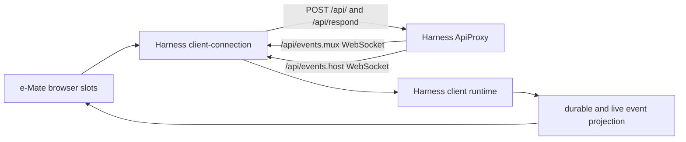

# e-Mate 2.0.11 architecture

The normative product and source boundaries live in [target-contract.md](target-contract.md). This document records how the implementation satisfies them without forking the pinned DeepSeek Harness architecture.

## Runtime ownership

DeepSeek Harness `0.1.0-rc.7` at downstream commit `2bc16230975f6cf02aa1b283b1f86de44007b059` (upstream base `99f6f02fecdb7dff40c3fbc9470f5907c29f74ca`) is the only local runtime core. It owns the Agent Loop, sessions, durable event logs, model calls, tools, approvals, attachments, Jobs, plugin loading, reconnect semantics, and persistence.

`@e-mate/desktop@2.0.11` is the native carrier for Electron, the pinned Harness closure, startup/shutdown, updater trust, packaged platform runtimes and renderer-health recovery. Product branding and behavior live in independently versioned Profile components selected by one signed generation. Neither layer replaces the Harness runtime, and there is no Runtime/Browser platform-package family or second plugin loader.

All maintained application source is TypeScript or TSX and is built with the exact Harness `tsdown` installation. Node-executable JavaScript and browser bundles under `lib/` are generated artifacts.

## Browser-to-CLI seam

The network and object model are inherited unchanged:

- `@deepseek-ai/dsh-client-connection` owns the HTTP uplink, two downlink-only WebSockets, trust fence, readiness handshake, reconnect generation, and backoff.
- `ApiProxy` owns typed RPC envelopes, validation, correlation IDs, session history, approvals, questions, model selection, attachments, and Job projections.
- The Harness client runtime owns Session objects, event-window reconciliation, deduplication, reconnect/resync, immutable snapshots, microtask batching, and animation-frame token publication.
- e-Mate browser code consumes Cordis services and registers `dsh.client` UI slots. Cross-plugin behavior travels through services and slots, not imports of another plugin's implementation.

Forbidden in e-Mate code: a second WebSocket or SSE client, a new session/events REST facade, a duplicate normalized conversation store, synthetic activity frames, a second reconnect loop, or tool-name dispatch in the central chat surface.

## UI overlay

The e-Mate 2.0.5 submodule is a read-only visual source for the final e-Mate 2.0.4/2.0.5 brand assets, current `desktop/src/v1` component structure, and current design tokens. Historical `docs/v0.*`/`docs/v1.*` screenshots are not implementation references. Desktop runtime code, Electron bridges, native updater code, window compensation, and the old message/runtime client are not imported.

Task `019ff91c-47ca-7c11-93bd-863475181a18` is the binding page/component baseline. Task `019ff665-d721-79a0-869d-338f086cf529` is the binding conversation upgrade: L0–L4 progressive disclosure, one mutable row per real Activity ID and attempt, `Working for`/`Worked for` lifecycle, nested Shell details, approvals/errors, and a final answer followed by a separate artifact shelf. The implementation may change carriers and state sources to Harness contracts, but not the visible hierarchy or interaction meaning.

The overlay replaces or contributes Harness slots for the shell, capability center, settings, and tool renderers. Conversation data and actions continue to arrive through `ctx.sessions`, `ctx.conversation`, `ctx.connection`, `ctx.layout`, `ctx.slots`, and plugin-provided services.

## Enterprise boundary

Only `emate.identity`, `emate.modelPolicy`, and `emate.audit` may communicate with the existing enterprise endpoints. First-use agreement status and archive submission belong to `emate.identity`. The browser calls that Host plugin through the target Connection generic RPC service, so credentials remain Host-side and no new carrier is introduced. Audit uses a durable local outbox and cannot block local execution. A valid cached login lease, current agreement receipt, and last valid model policy keep working during enterprise loss; new/expired authentication or an unsigned required agreement fails closed.

No enterprise API may enable or disable plugins, approve tools, delete sessions, control local Jobs, or start/stop the local runtime.

The implemented model-policy adapter wraps the target `apiProxy.sessions.models`, `session.selectModel`, `llm.models`, and `agent/request` seams in place. The browser therefore receives the same Harness model catalog and selection action, filtered by the account's signed `allowed_model_ids`; the actual provider request is checked again at the runtime boundary. A policy cache lives in the target Storage Domain and is reusable only for the same hashed account subject, an unexpired policy, the fixed public/model mapping, and an unchanged payload digest. Enterprise loss may use that last valid cache, but an unknown account, expired policy, mapping drift, or disallowed selection fails closed.

The implemented audit adapter listens to the target `agent/request`, `assistant/message`, `session/event`, and `session/flush` lifecycle. It binds the real provider/model request to the current account-policy receipt, derives usage only from provider-reported terminal event fields, and stores idempotent facts in a target Storage Domain outbox. It does not record prompts, answers, raw account identities, raw session IDs, attachment bytes, paths, or credentials. Upload and retry are asynchronous and errors are reduced to non-sensitive digests; no audit failure changes the local Agent result. Production delivery remains disabled until the enterprise ingestion/receipt contract is verified, so the existing read-only usage-panel endpoint is never guessed to be an ingest API.

## Embedded Harness bundles

The bundled baseline and every hot Profile generation contain only the TypeScript/Cordis components declared by `packages/dsh/profile/component-inventory.json` through the target Loader and bundle/patch mechanism. The inventory is shared by CLI compatibility, Desktop composition, change classification and release. Components reuse target services, module IDs, slots, Session events and Connection RPC; they do not add a second WebUI-to-Host protocol, Store, Router, Agent Loop or package installer.

`office-skills` supplies four clean-room Skills for documents, PDF, spreadsheets and presentations. It does not ship the deleted Python Worker or claim local Office-format execution until an accepted host toolchain closes the action. `search-mcp` adapts MCP discovery/calls to the target Web/Tool path. `genui` and `better-sidebar` contribute target UI slots. The pinned Harness remains the sole owner of native Subagent services.

Browser control is `@e-mate/dsh-plugin-cdp`: a dependency-free loopback CDP client registered as ordinary DSH Tools. It binds target selection and accessibility snapshots to the current Agent session, uses target approval for mutations, and never downloads or launches a browser. There is no extension, Browser Panel, extra UI transport or Base browser bridge. macOS and Windows remain platform-gated until real installed-browser session isolation, action and recovery runs pass.

`vision-toolkit` is a Desktop-only rc.7 hot Profile component. It retains the pinned native Skill, visual Tools, pasted-image codec, Tool views, Artifact preview/download and health surface, while consuming only the Desktop's stable packaged-Python seam. Its model route and credential remain read-only enterprise-policy projections; the Web surface cannot mutate either.

## Project-scoped memory

The pinned Harness workspace domain is the binding authority. `WorkspaceRegistry` owns a stable workspace ID and validates membership by comparing each immutable session header `cwd` with the workspace's canonical real path. The `memory-evolve` adapter consumes that service; it does not infer a project from the browser label or maintain a second project catalog. The deleted standalone dream/learning implementations are not composed as parallel system plugins.

Each stored item carries the workspace ID and canonical-path fingerprint used when it was written. Reads and writes require both the active session membership and the current registry binding to match. Workspace renaming leaves the binding intact; a moved/missing directory, cross-project session, or ambiguous legacy source fails closed. Sessions that are not registered to a workspace may use only a private session scope. Imported CowAgent material is copied into the resolved scope and never linked back to a mutable legacy path.

Legacy file import is part of the same adapter and Storage Domain. It accepts only an exact canonical source-root match from `WorkspaceRegistry`; it does not create a second project catalog or guess a destination from a session title. Deterministic record identities and `$DSH_HOME/e-mate/migrations/legacy-memory-v1.json` make the copy idempotent. User-scoped legacy files remain blocked until enterprise identity can prove the account mapping, which prevents an old user's private memory from becoming project-shared content.

## Legacy-session import

Legacy import is a producer for the target event log, not a replacement session subsystem. `e-mate setup` composes the pinned Harness `Context`, `SessionStore`, and `JsonlSessionPersistence`, validates old e-Mate/ECoreX/CowAgent snapshots, and writes balanced target events through `ctx.sessionPersistence`. The managed profile fallback injects the same `sessionPersistence` service. Neither path owns a second SQLite conversation database, browser cache, message schema, reconnect path, or WebUI protocol.

Current e-Mate Runtime data has precedence over native ECoreX, which has precedence over older CowAgent rows. Deleted Runtime threads are excluded. Historical non-message items remain local read-only evidence and never become fake Harness Tool events. Stable Session IDs and full header/event equality make reruns idempotent and fail closed on collisions. The complete safety and receipt contract is in [migration.md](migration.md).

Imported artifact rows remain ignorable Session evidence until the e-Mate client module claims them through Harness `conversationEvents`. That module registers a keyed chat renderer and a verified loopback download action; the generic chat assembler, transport, and target Session event model remain unchanged.

## Schedule ownership

The managed profile loads upstream `@deepseek-ai/dsh-schedule`; its versioned `schedule/change` Session stream is the only durable live schedule state, and its disposable runtime owns timers and due delivery. e-Mate does not implement recurrence math, cold-session wakeup, a global task table, or a browser scheduler API.

Old `tasks.json` rows are a migration catalog only. They enter a local mode-0600 disabled receipt after bounded no-follow validation. Unsupported source semantics remain blocked. After a separate exact user confirmation, the import Tool nests the official `schedule_list`/`schedule_create` Tools in the current Agent scope, so the target's validation, tool policy, persistence checkpoints, event append, and runtime drive remain authoritative.

The pinned shipped baseline was audited before selecting the embedded bundles. Search, Office Skills, browser control, Vision/OCR, memory and UI extensions remain target-loader plugins with explicit readiness; no deleted local Worker or browser runtime is retained as a fallback. Capability presence in the tarball is not acceptance: Vision/OCR becomes ready only after its managed runtime and enterprise model route pass health, and browser control remains setup-required until its named platform gates pass.

## Identity and usage continuity

The identity plugin extends the old `login`, `logout`, and `password` payload/receipt semantics over the same Harness Connection RPC channel. `verification.issue` obtains a bounded, one-time enterprise image challenge; `session.register` submits account, mandatory real name, password, challenge identity, and code and accepts only a `pending_approval` receipt. It does not authenticate or unlock the workspace.

The existing administrator user workspace remains the authority for list/read/create/update, usage limits, password state and audit. Its server contract is extended with pending approval and explicit soft deletion: approval requires `weekly_token_limit > 0`, a valid model policy, and an auth-revision mutation; suspend/delete/password/allowance mutations revoke leases. This is an identity/model-policy administration surface, not a route to local sessions, tools, plugins or Jobs.

`session.login` forwards `remember_login` to the enterprise provider and accepts the resulting bootstrap only when the account is `active` and the signed weekly Token allowance is positive. Remembering a login changes the enterprise lease duration only. Host-side transport and OS-keystore credentials remain private; no browser storage contains a password or token. Password change revokes the active account leases and forces reauthentication; neither the target runtime nor the browser is allowed to treat the current session as valid after the change receipt.

The audit plugin projects only real terminal provider usage facts. Its durable outbox identity is derived from the provider request or image Job identity, and the enterprise store remains the existing immutable provider-usage ledger. Reconciliation compares identities and fields rather than trusting aggregate counters: source, account, usage kind, input/output/total tokens or image count, provider time, requested/actual model and fallback metadata, product generation/version, result status, payload hash, and server receipt.
